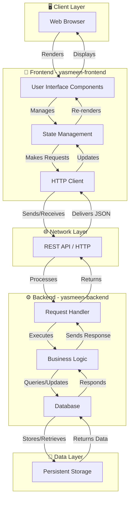

# Yasmeen Application Architecture

## Overview

This document outlines the architecture of the Yasmeen application, which consists of a frontend and backend system working together to deliver a complete web solution.

## Architecture Diagram

## Technology Stack

### Frontend - yasmeen-frontend
- **Primary Language:** JavaScript (99.7%)
- **Type:** Client-side web application
- **Responsibilities:**
  - Render user interface
  - Handle user interactions
  - Manage application state
  - Communicate with backend API
  - Display data to users

### Backend - yasmeen-backend
- **Primary Languages:** 
  - HTML (56.2%)
  - Python (43.5%)
  - Dockerfile (0.3%)
- **Type:** Server-side application
- **Responsibilities:**
  - Process API requests
  - Implement business logic
  - Manage database operations
  - Handle authentication & authorization
  - Serve API endpoints

## Communication Flow

1. **User Action** → Frontend captures user input
2. **API Request** → Frontend sends HTTP request to backend
3. **Processing** → Backend processes the request using business logic
4. **Data Operation** → Backend interacts with database
5. **API Response** → Backend returns response to frontend
6. **UI Update** → Frontend updates the user interface with new data

## Deployment Architecture

Both services can be containerized and deployed independently:
- **Frontend:** Serves static assets and JavaScript files
- **Backend:** Runs in containers (see Dockerfile in backend repo) and exposes API endpoints

---

*Last Updated: 2026-05-25*
