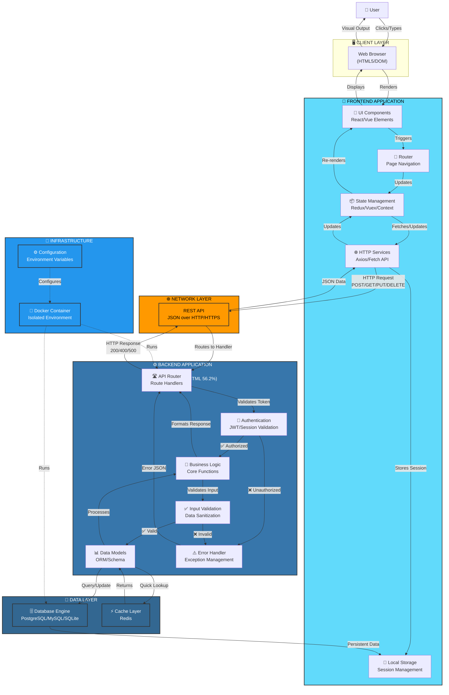
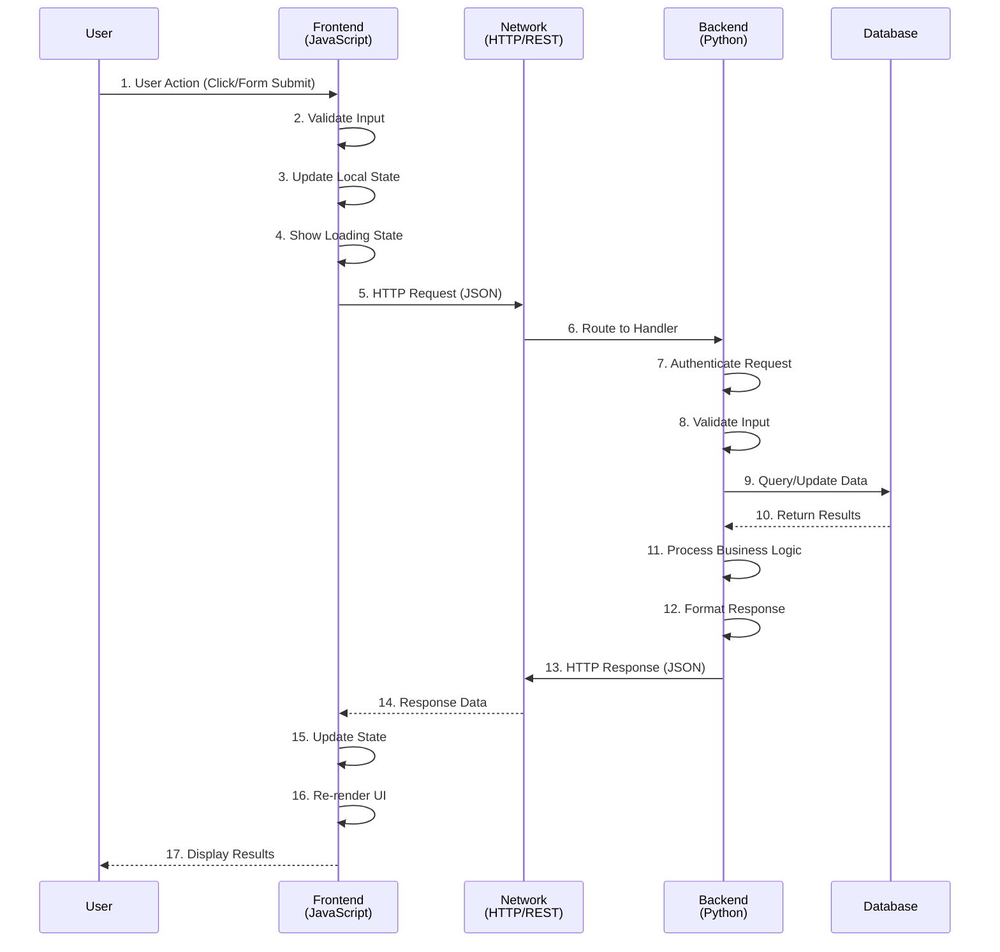
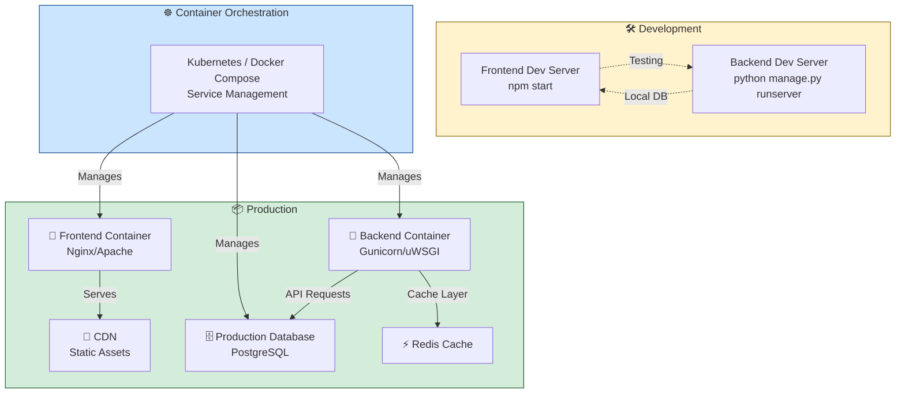

# Yasmeen Application Architecture

## Overview

Yasmeen is a full-stack web application with a JavaScript-based frontend and Python-based backend, communicating through REST APIs to deliver a seamless user experience.

---

## 🏗️ Architecture Diagram

---

## 📊 Technology Stack Details

### **Frontend - yasmeen-frontend**
| Component | Technology | Purpose |
|-----------|-----------|---------|
| **Language** | JavaScript (99.7%) | Core application logic |
| **Routing** | React Router / Vue Router | Client-side navigation |
| **State Management** | Redux / Vuex / Context API | Global state handling |
| **HTTP Client** | Axios / Fetch API | API communication |
| **UI Framework** | React / Vue / Angular | Component rendering |
| **Storage** | LocalStorage / SessionStorage | Client-side caching |

### **Backend - yasmeen-backend**
| Component | Technology | Purpose |
|-----------|-----------|---------|
| **Language** | Python (43.5%) | Server-side logic |
| **Framework** | Flask / Django / FastAPI | REST API framework |
| **Templates** | HTML (56.2%) | Server-rendered views |
| **Authentication** | JWT / Session-based | User authentication |
| **Database ORM** | SQLAlchemy / Django ORM | Data model mapping |
| **Validation** | Marshmallow / Pydantic | Input validation |
| **Containerization** | Docker (0.3%) | Environment isolation |

---

## 🔄 Data Flow Sequence

---

## 🔐 Security Layers

```mermaid
graph LR
    A["Client Request"] --> B["HTTPS Encryption"]
    B --> C["Authentication<br/>JWT/Session"]
    C --> D["Authorization<br/>Role Check"]
    D --> E["Input Validation"]
    E --> F["Rate Limiting"]
    F --> G["Business Logic<br/>with Validation"]
    G --> H["Database<br/>with Prepared Statements"]
    H --> I["Encrypted Response"]
    I --> J["Client"]
    
    style B fill:#ff6b6b
    style C fill:#ff6b6b
    style D fill:#ff6b6b
    style E fill:#ff6b6b
    style F fill:#ff6b6b
    style H fill:#ff6b6b
```

---

## 🚀 Deployment Architecture

---

## 📈 Component Interaction Matrix

| Frontend → Backend | Request Method | Data Format | Authentication | Response |
|-------------------|---|---|---|---|
| Fetch User Data | `GET /api/users/:id` | JSON Query | JWT Token | `{user_data}` |
| Create Resource | `POST /api/resources` | JSON Body | JWT Token | `{created_id}` |
| Update Resource | `PUT /api/resources/:id` | JSON Body | JWT Token | `{updated_data}` |
| Delete Resource | `DELETE /api/resources/:id` | N/A | JWT Token | `{status}` |
| Login | `POST /api/auth/login` | Username/Password | None | `{token}` |
| Search | `GET /api/search?q=term` | Query Params | JWT Token | `{results}` |

---

## 🔧 Key Features

### **Frontend Capabilities**
- ✅ Responsive UI with real-time updates
- ✅ Client-side validation and error handling
- ✅ Offline mode with local storage
- ✅ Session management and auto-logout
- ✅ Loading states and animations

### **Backend Capabilities**
- ✅ RESTful API endpoints
- ✅ User authentication and authorization
- ✅ Database transactions and rollback
- ✅ Error logging and monitoring
- ✅ Rate limiting and DDoS protection
- ✅ Automated backups and recovery
- ✅ Environment-based configuration

---

## 📝 Summary

**Yasmeen** is built as a modern, scalable web application:
- **Frontend**: JavaScript-powered interactive user interface
- **Backend**: Python-based robust business logic and data management
- **Communication**: REST API with JSON payloads over HTTPS
- **Infrastructure**: Containerized deployment with Docker
- **Security**: Multi-layer authentication, validation, and encryption

---

*Last Updated: 2026-05-25*
*Architecture Version: 2.0*